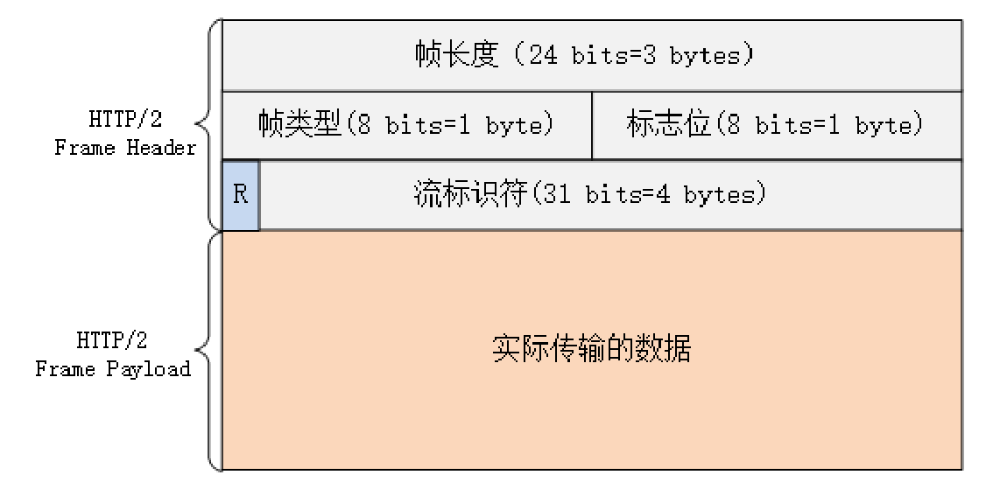

# HTTP/2 特性概览

由于 HTTPS 已经在安全方面做的非常好了，所以 HTTP/2 的唯一目标就是改进性能。

在语义保持稳定之后，HTTP/2 在语法层做了天翻地覆的改造，**完全变更了 HTTP 报文的传输格式**

## 头部压缩
+ 首先，HTTP/2 对报文的头部做了一个大手术（背景）：

通过进阶篇的学习你应该知道，HTTP/1 里可以用头字段 `Content-Encoding` 指定 Body 的编码方式，比如用 gzip 压缩来节约带宽，但报文的另一个组成部分—— **Header 却被无视了，没有针对它的优化手段** 。

由于报文 Header 一般会携带 `User Agent`、`Cookie`、`Accept`、`Server` 等许多固定的头字段，多达几百字节甚至上千字节，但 Body 却经常只有几十字节（比如 GET 请求、204/301/304 响应）更要命的是，成千上万的请求响应报文里有很多字段值都是重复的，非常浪费，长尾效应导致大量带宽消耗在了这些冗余度极高的数据上。

+ 所以，HTTP/2 把 **头部压缩** 作为性能改进的一个重点，优化的方式你也肯定能想到，还是 **压缩**（方式） 。
  
不过 HTTP/2 并没有使用传统的压缩算法，而是开发了专门的 **HPACK** 算法，在客户端和服务器两端建立「字典」，用索引号表示重复的字符串，还釆用哈夫曼编码来压缩整数和字符串，可以达到 50%~90% 的高压缩率。

### 具体的头部压缩讲解：

`HPACK` 算法是专门为压缩 HTTP 头部定制的算法，需要客户端和服务器各自维护一份索引表，也可以说是字典（这有点类似 brotli），压缩和解压缩就是查表和更新表的操作。

+ 首先，为了方便管理和压缩，HTTP/2 废除了原有的起始行概念，把起始行里面的请求方法、URI、状态码等统一转换成了头字段的形式，并且给这些“不是头字段的头字段起了个特别的名字—— **伪头字段** （pseudo-header fields）。而起始行里的版本号和错误原因短语因为没什么大用，顺便也给废除了。
+ eg：为了与真头字段区分开来，这些伪头字段会在名字前加一个 `:` ，比如 `:authority`、`:method`、 `:status`，分别表示的是域名、请求方法和状态码。

+ 现在 HTTP 报文头就简单了，全都是 `Key-Value` 形式的字段，于是 HTTP/2 就为一些最常用的头字段定义了一个只读的 **静态表**（Static Table）。
下面的这个表格列出了静态表的一部分，这样只要查表就可以知道字段名和对应的值，比如数字 `2` 代表 `GET` ，数字 `8` 代表状态码 200。

+ 如果是自定义字段，索引表中根本找不到该怎么办呢？这就要用到 **动态表**（Dynamic Table），它添加在静态表后面，结构相同，但会在编码解码的时候随时更新。

+ eg：第一次发送请求时的 `user-agent` 字段长是一百多个字节，用哈夫曼压缩编码发送之后，客户端和服务器都更新自己的动态表，添加一个新的索引号 `65` 。那么下一次发送的时候就不用再重复发那么多字节了，只要用一个字节发送编号就好（相当于是缓存起来了）
+ 所以，随着在 HTTP/2 连接上发送的报文越来越多，两边的字典也会越来越丰富，最终每次的头部字段都会变成一两个字节的代码，原来上千字节的头用几十个字节就可以表示了，压缩效果比 gzip 要好得多。

## 二进制帧
头部数据压缩之后，HTTP/2 就要把报文拆成二进制的帧准备发送，如下图：可以看到原本的header+body报文结构就完全消失了，变成一个个Frame的传输。

帧结构如下图：

+ 帧开头是 3 个字节的 **长度**，长度后面的一个字节是 **帧类型** ，大致可以分成 **数据帧** 和 **控制帧** 两类，HEADERS 帧和 DATA 帧属于数据帧，存放的是 HTTP 报文。
而 SETTINGS、PING、PRIORITY 等则是用来管理流的控制帧。
+  **帧标志**携带简单的控制信息。常用的标志位有 **END_HEADERS** 表示头数据结束，相当于 HTTP/1 里头后的空行（`\r\n`），**END_STREAM** 表示单方向数据发送结束（即 EOS，End of Stream），相当于 HTTP/1 里 Chunked 分块结束标志（ `0\r\n\r\n` ）。
+  **流标识符** ，也就是帧所属的 `流` ，接收方使用它就可以从乱序的帧里识别出具有相同流 ID 的帧序列，按顺序组装起来就实现了虚拟的“流”。

再看抓包实例：

+ 在这个帧里，数据长度是 266 字节。帧类型是 1，表示 HEADERS 帧，负载（payload）里面存放的是被 HPACK 算法压缩的头部信息。
+ PRIORITY 表示设置了流的优先级，END_HEADERS 表示这一个帧就是完整的头数据，END_STREAM 表示单方向数据发送结束，后续再不会有数据帧（即请求报文完毕，不会再有 DATA 帧 /Body 数据）。

## 流与多路复用
一句话总结：**流是二进制帧的双向传输序列**

要搞明白流，关键是要理解帧头里的流 ID：
在 HTTP/2 连接上，虽然帧是乱序收发的，但只要它们都拥有相同的流 ID，就都属于一个流，而且在这个流里帧不是无序的，而是有着严格的先后顺序。

在概念上，一个 HTTP/2 的流就等同于一个 HTTP/1 里的 `请求 - 应答` 。在 HTTP/1 里一个请求 - 响应报文来回是一次 HTTP 通信，在 HTTP/2 里一个流也承载了相同的功能。

同时，在一个 HTTP/2 连接上可以并发多个流，也就是多个“请求 - 响应”报文，这就是多路复用。

HTTP/2 的流也有一个状态转换图，如下：

具体说明如下：
+ 最开始的时候流都是 **空闲**（idle）状态，也就是「不存在」，可以理解成是待分配的号段资源。
当客户端发送 HEADERS 帧后，有了流 ID，流就进入了 **打开** 状态，两端都可以收发数据，然后客户端发送一个带 `END_STREAM` 标志位的帧，流就进入了 **半关闭** 状态。
+ 这个 **半关闭** 状态很重要，意味着客户端的请求数据已经发送完了，需要接受响应数据，而服务器端也知道请求数据接收完毕，之后就要内部处理，再发送响应数据。
+ 响应数据发完了之后，也要带上 `END_STREAM` 标志位，表示数据发送完毕，这样流两端就都进入了 **关闭** 状态，流就结束了。
+ 流 ID 不能重用，所以流的生命周期就是 HTTP/1 里的一次完整的请求 - 应答，流关闭就是一次通信结束。

