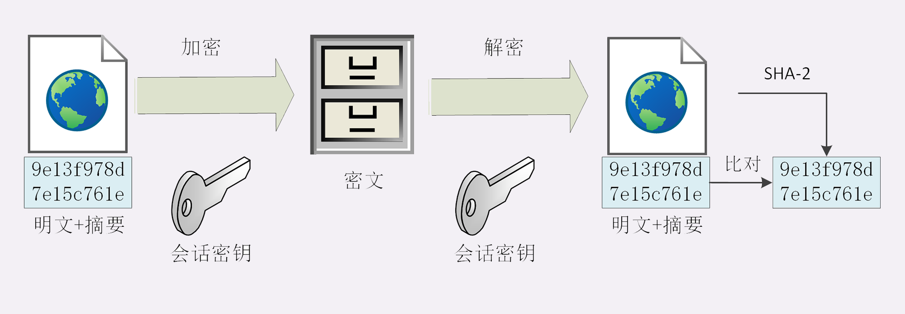

# HTTPS相关总结

1. 因为 HTTP 是明文传输，所以不安全，容易被黑客窃听或窜改；
2. 通信安全必须同时具备机密性、完整性，身份认证和不可否认这四个特性；
3. HTTPS 的语法、语义仍然是 HTTP，但在下层的协议 TCP/IP 基础之上加了 SSL/TLS（HTTPS = HTTP + SSL/TLS）；
4. SSL/TLS 是信息安全领域中的权威标准，采用多种先进的加密技术保证通信安全；

## 机密性
实现机密性最常用的手段是 **加密**（encrypt），就是把消息用某种方式转换成谁也看不懂的乱码，只有掌握 **特殊钥匙** 的人才能再转换出原始文本。

+ 这里的钥匙就叫做 **密钥**（key），加密前的消息叫 **明文**（plain text/clear text），加密后的乱码叫 **密文**（cipher text），使用密钥还原明文的过程叫 **解密**（decrypt），加密解密的操作过程就是 **加密算法** 。
+ 按照密钥的使用方式，加密可以分为两大类：**对称加密和非对称加密**。

1. **对称加密**： 就是指加密和解密时使用的 **密钥都是同一个** ，是 **对称** 的。只要保证了密钥的安全，那整个通信过程就可以说具有了机密性。(对称加密算法eg: AES)

2. **非对称加密**：
有两个密钥，一个叫 **公钥**（public key），一个叫 **私钥**（private key）。**两个密钥是不同的（不对称）** ，公钥可以公开给任何人使用，而私钥必须严格保密。
公钥和私钥有个特别的 **单向** 性，虽然都可以用来加密解密，但 **公钥加密后只能用私钥解密** ，反过来，**私钥加密后也只能用公钥解密** 。(非对称加密算法eg: RSA)

3. **混合加密**：
   RSA 的运算速度是非常慢的，2048 位的加解密大约是 15KB/S（微秒或毫秒级），而 AES128 则是 13MB/S（纳秒级），**差了几百倍** 。
那么，是不是能够 **把对称加密和非对称加密结合起来** 呢，两者互相取长补短，即能高效地加密解密，又能安全地密钥交换。
   1. **首先在通信刚开始的时候使用非对称算法** （比如 RSA、ECDHE）**解决密钥交换的问题，之后利用交换的密钥进行对称加密通信** 。
   2. 随机数产生对称算法使用的 **会话密钥**（session key），用 **公钥加密** 。因为会话密钥很短，通常只有 16 字节或 32 字节，所以慢一点也无所谓。
   3. 对方拿到密文后用 **私钥解密** ，取出会话密钥。这样，双方就实现了对称密钥的安全交换，后续就不再使用非对称加密，全都使用对称加密。

## 摘要算法和数字签名

实现 **完整性** 的手段主要是 **摘要算法**（Digest Algorithm）

+ 摘要算法保证了 **数字摘要** 和原文是 **完全等价** 的。所以，我们只要在原文后附上它的摘要，就能够保证数据的完整性。
+ **真正的完整性必须要建立在机密性之上** ，在混合加密系统里用 会话密钥 加密消息和摘要，这样黑客无法得知明文，也就没有办法动手脚了。
  

而数字签名 实现了 **身份认证** 和 **不可否认**。数字签名的原理其实很简单：
+ 就是把公钥私钥的用法反过来，之前是公钥加密、私钥解密，现在是私钥加密、公钥解密。
+ **但又因为非对称加密效率太低，所以私钥只加密原文的摘要** ，这样运算量就小的多，而且得到的数字签名也很小，方便保管和传输。
+ 签名和公钥一样完全公开，任何人都可以获取。但这个签名只有用私钥对应的公钥才能解开，拿到摘要后，再比对原文验证完整性，就可以像签署文件一样证明消息确实是你发的。（**因为签名是由私钥来加密的，而私钥是其他人获取不到的，具有身份的认证**）
  
  
所以，只要 **你和网站互相交换公钥** ，就可以用 **签名** 和 **验签** 来确认消息的真实性，**因为私钥保密，黑客不能伪造签名** ，就能够保证通信双方的身份。
同时，这也是防止中间人攻击的方案。

## 数字证书和 CA
一个 **公认的可信第三方** ，让它作为「信任的起点，递归的终点」，构建起公钥的信任链。
CA主要是解决**公钥信任**的问题

证书的校验：

**有了这个证书体系，操作系统和浏览器都内置了各大 CA 的根证书** ，上网的时候只要服务器发过来它的证书，就可以验证证书里的签名，顺着证书链（Certificate Chain）一层层地验证，直到找到根证书，就能够确定证书是可信的，从而里面的公钥也是可信的。

## TLS 1.2 连接过程

在 HTTP 协议里，建立连接后，浏览器会立即发送请求报文。但现在是 HTTPS 协议，它需要再用另外一个 「**握手**」过程，在 TCP 上建立安全连接，之后才是收发 HTTP 报文。

用上图来仔细剖析 TLS 的握手过程：

**注意**：图示每一个箭头都代表一个发送记录。多个记录并为一次消息。所以，最多经过两次消息往返（4 个消息）就可以完成握手，然后就可以在安全的通信环境里发送 HTTP 报文，实现 HTTPS 协议。

1. 在 TCP 建立连接之后，浏览器会首先发一个 **Client Hello** 消息，也就是跟服务器打招呼。里面有客户端的版本号、支持的密码套件，还有一个 **随机数（Client Random）** ，用于后续生成会话密钥。
2. 服务器收到 `Client Hello` 后，会返回一个 `Server Hello` 消息。把版本号对一下，也给出一个 **随机数（Server Random）** ，然后从客户端的列表里选一个作为本次通信使用的密码套件
3. 然后，服务器为了证明自己的身份，就把证书也发给了客户端（Server Certificate）
4. 接下来是一个关键的操作，因为服务器选择了 ECDHE 算法，所以它会在证书后发送 **Server Key Exchange** 消息，里面是 **椭圆曲线的公钥（Server Params）** ，用来实现密钥交换算法，再加上自己的私钥签名认证。
5. 之后是 **Server Hello Done** 消息，服务器说：我的信息就是这些，打招呼完毕。
+ 这样第一个消息往返就结束了（两个 TCP 包），结果是客户端和服务器通过明文共享了三个信息：**Client Random、Server Random 和 Server Params**
6. 客户端这时也拿到了服务器的证书，那这个证书是不是真实有效的呢？
这就要用到上一讲里的知识了，开始走证书链逐级验证，确认证书的真实性，再用证书公钥验证签名，就确认了服务器的身份
7. 客户端按照密码套件的要求，也生成一个 **椭圆曲线的公钥（Client Params）** ，用 **Client Key Exchange** 消息发给服务器
8. 现在客户端和服务器手里都拿到了密钥交换算法的两个参数（Client Params、Server Params），就用 ECDHE 算法一阵算，算出了一个新的东西，叫 **Pre-Master** ，其实也是一个随机数
9. 现在客户端和服务器手里有了三个随机数：**Client Random、Server Random 和 Pre-Master** 。用这三个作为原始材料，就可以生成用于加密会 话的主密钥，叫 **Master Secret** (而黑客因为拿不到 `Pre-Master` ，所以也就得不到主密钥。)
+ 注意：主密钥有 48 字节，但它也不是最终用于通信的会话密钥，还会再用 PRF 扩展出更多的密钥，比如客户端发送用的会话密钥（client_write_key）、服务器发送用的会话密钥（server_write_key）等等，避免只用一个密钥带来的安全隐患。
10. 有了主密钥和派生的会话密钥，握手就快结束了。客户端发一个 **Change Cipher Spec** ，然后再发一个 **Finished** 消息，把之前所有发送的数据做个摘要，再加密一下，让服务器做个验证。
11. 服务器也是同样的操作，发 **Change Cipher Spec** 和 **Finished** 消息，双方都验证加密解密 OK，握手正式结束，后面就收发被加密的 HTTP 请求和响应了。

此外，还有在RSA加密算法基础之上的握手过程，贴图如下，有些许区别：

