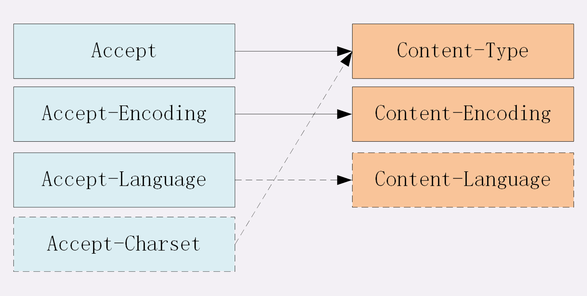
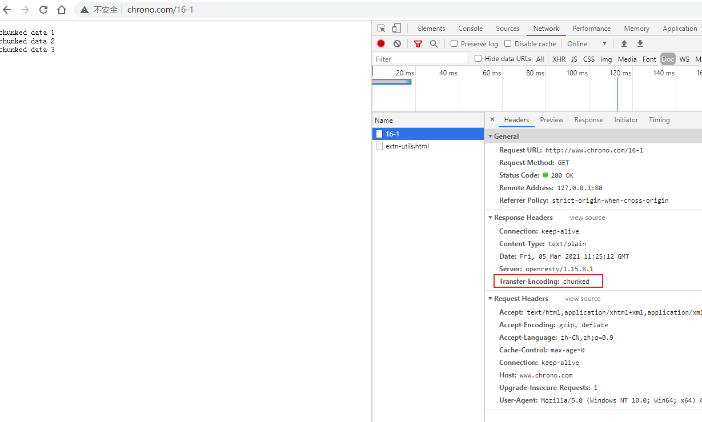
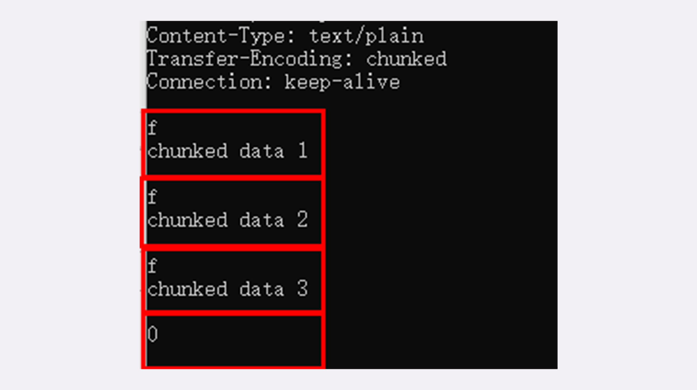
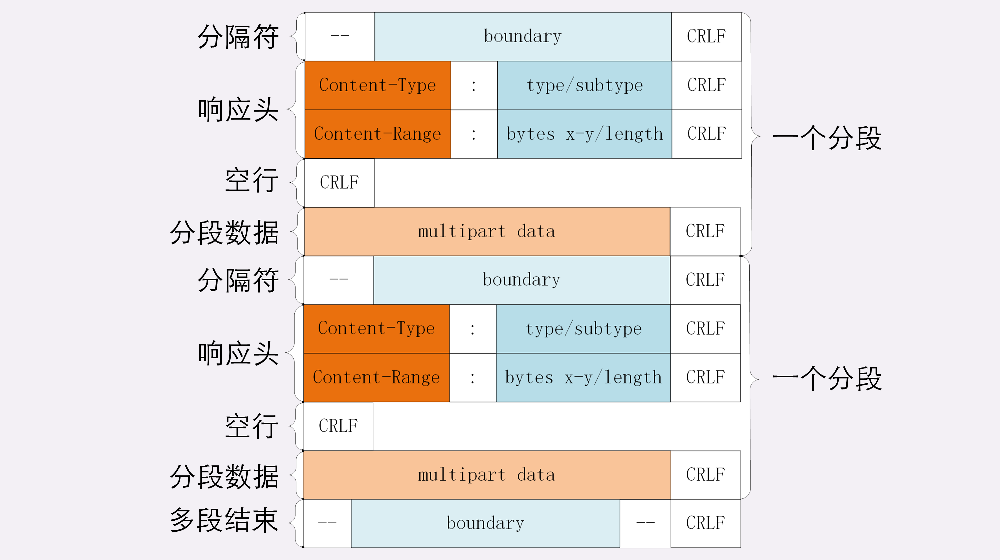

## HTTP 的实体数据

### 数据类型与编码
MIME type 用来标记 body 的数据类型。形式是 `type/subtype`  的字符串

简单列举一下在 HTTP 里经常遇到的几个类别：
1. text：即文本格式的可读数据，我们最熟悉的应该就是 `text/html` 了，表示超文本文档，此外还有纯文本 `text/plain`、样式表 `text/css` 等。
2. image：即图像文件，有 `image/gif`、`image/jpeg`、`image/png` 等。
3. `audio/video`：音频和视频数据，例如 `audio/mpeg`、`video/mp4` 等。
4. application：数据格式不固定，可能是文本也可能是二进制，必须由上层应用程序来解释。常见的有 `application/json`，`application/javascript`、`application/pdf` 等，另外，如果实在是不知道数据是什么类型，像刚才说的黑盒，就会是 `application/octet-stream`，**即不透明的二进制数据** 。


还有`Encoding type` 用于压缩数据。 告诉数据是用的什么编码格式，这样对方才能正确解压缩，还原出原始的数据.

Encoding type 就少了很多，常用的只有下面三种：
1. gzip：GNU zip 压缩格式，也是互联网上最流行的压缩格式；
2. deflate：zlib（deflate）压缩格式，流行程度仅次于 gzip；
3. br：一种专门为 HTTP 优化的新压缩算法（Brotli）。

HTTP 协议为此定义了两个 `Accept`  请求头字段和两个 `Content` 实体头字段，用于客户端和服务器进行 **内容协商**。

也就是说，**客户端用 Accept 头告诉服务器希望接收什么样的数据** ，**而服务器用 Content 头告诉客户端实际发送了什么样的数据**。


+ **Accept** 字段标记的是 **客户端可理解的 MIME type** ，可以用 `,` 做分隔符列出多个类型，让服务器有更多的选择余地，例如下面的这个头：`Accept: text/html,application/xml,image/webp,image/png`
+ 相应的，服务器会在响应报文里用头字段 `Content-Type` 告诉实体数据的真实类型：
+ Content-Type 字段不仅仅用在响应中，它是实体（body）字段，标识 body 中的内容是什么，也就是说可以在请求头和响应头中使用

eg:
```
Content-Type: text/html
Content-Type: image/png
```
这样浏览器看到报文里的类型是 `text/html` 就知道是 HTML 文件，会调用排版引擎渲染出页面，看到 `image/png` 就知道是一个 PNG 文件，就会在页面上显示出图像。

+ **Accept-Encoding** 字段标记的是 **客户端支持的压缩格式** ，例如上面说的 gzip、deflate 等，同样也可以用 `,` 列出多个，服务器可以选择其中一种来压缩数据，实际使用的压缩格式放在响应头字段  **Content-Encoding** 里。
```
Accept-Encoding: gzip, deflate, br
Content-Encoding: gzip
```

### 语言类型与字符集

+ **Accept-Language** 字段标记了 **客户端可理解的自然语言** ，也允许用 ` ,` 做分隔符列出多个类型，例如：
`Accept-Language: zh-CN, zh, en` 这个请求头会告诉服务器：最好给我 zh-CN 的汉语文字，如果没有就用其他的汉语方言，如果还没有就给英文。
+ 相应的，服务器应该在响应报文里用头字段 **Content-Language** 告诉客户端实体数据使用的实际语言类型：`Content-Language: zh-CN`
+ 字符集在 HTTP 里使用的请求头字段是 **Accept-Charset** ，但响应头里却没有对应的 Content-Charset，而是在**Content-Type** 字段的数据类型后面用 `charset=xxx` 来表示，这点需要特别注意.
+ eg:浏览器请求 GBK 或 UTF-8 的字符集，然后服务器返回的是 UTF-8 编码
```
Accept-Charset: gbk, utf-8
Content-Type: text/html; charset=utf-8
```


不过现在的浏览器都支持多种字符集，通常不会发送 Accept-Charset，而服务器也不会发送 Content-Language，因为使用的语言完全可以由字符集推断出来，所以在请求头里一般只会有 `Accept-Language`  字段，响应头里只会有 `Content-Type`  字段。

### 内容协商的质量值

在 HTTP 协议里用 Accept、Accept-Encoding、Accept-Language 等请求头字段进行内容协商的时候，还可以用一种特殊的 `q` 参数表示权重来设定优先级，这里的 `q` 是 `quality factor`的意思。

+ 权重的最大值是 1，最小值是 0.01，默认值是 1，如果值是 0 就表示拒绝。
+ 具体的形式是在数据类型或语言代码后面加一个 `;` ，然后是 `q=value` 。

eg: `Accept: text/html,application/xml;q=0.9,*/*;q=0.8`

它表示浏览器最希望使用的是 HTML 文件，权重是 1，其次是 XML 文件，权重是 0.9，最后是任意数据类型，权重是 0.8。服务器收到请求头后，就会计算权重，再根据自己的实际情况优先输出 HTML 或者 XML。

### 小结：



1. 客户端需要在请求头里使用 Accept 等头字段与服务器进行内容协商，要求服务器返回最合适的数据；
2. 数据类型表示实体数据的内容是什么，使用的是 MIME type，相关的头字段是 Accept 和 Content-Type；
3. 数据编码表示实体数据的压缩方式，相关的头字段是 Accept-Encoding 和 Content-Encoding；
4. 语言类型表示实体数据的自然语言，相关的头字段是 Accept-Language 和 Content-Language；
5. 字符集表示实体数据的编码方式，相关的头字段是 Accept-Charset 和 Content-Type；
6. Accept 等头字段可以用 `,` 顺序列出多个可能的选项，还可以用 `;q=` 参数来精确指定权重。

## HTTP的传输

**如何在有限的带宽下高效快捷地传输大文件是一个重要的课题**

### 数据压缩
通常浏览器在发送请求时都会带着 **Accept-Encoding** 头字段，里面是 **浏览器支持的压缩格式列表** ，例如 gzip、deflate、br 等，这样服务器就可以从中选择一种压缩算法，放进 **Content-Encoding** 响应头里，再把原数据压缩后发给浏览器。

+ 不过这个解决方法也有个缺点，gzip 等压缩算法通常只对文本文件有较好的压缩率，而图片、音频视频等多媒体数据本身就已经是高度压缩的，再用 gzip 处理也不会变小（甚至还有可能会增大一点），所以它就失效了。
+ 但数据压缩在处理文本的时候效果还是很好的，所以各大网站的服务器都会使用这个手段作为保底。

### 分块传输
压缩是把大文件整体变小，我们可以反过来思考，如果大文件整体不能变小，那就把它 **拆开** ，分解成多个小块，把这些小块分批发给浏览器，浏览器收到后再组装复原。

这种 **化整为零** 的思路在 HTTP 协议里就是 **chunked** 分块传输编码，在响应报文里用头字段 **Transfer-Encoding: chunked** 来表示，意思是报文里的 body 部分不是一次性发过来的，而是分成了许多的块（chunk）逐个发送。

来看一下分块传输的编码规则：
1. 每个分块包含两个部分，长度头和数据块；
2. 长度头是以 CRLF（回车换行，即 `\r\n` ）结尾的一行明文，用 16 进制数字表示长度；
3. 数据块紧跟在长度头后，最后也用 CRLF 结尾，但数据不包含 CRLF；
4. 最后用一个长度为 0 的块表示结束，即 `0\r\n\r\n`


用 Chrome 访问这个地址看一下效果：



查看原始数据：


### 范围请求
如果想获取一个大文件其中的片段数据，需要用到范围请求。允许客户端在请求头里使用专用字段来表示只获取文件的一部分。

+ 而服务器必须在响应头里使用字段 **Accept-Ranges: bytes** 明确告知客户端：「我是支持范围请求的」。
+ 请求头 **Range** 是 HTTP 范围请求的专用字段，格式是 **bytes=x-y**，其中的 x 和 y 是以字节为单位的数据范围。
+ 要注意 x、y 表示的是 **偏移量** ，范围必须从 0 计数，例如前 10 个字节表示为 `0-9`，第二个 10 字节表示为 `10-19` ，而 `0-10` 实际上是前 11 个字节。
+ 服务器收到 Range 字段后，需要做四件事：
    1. 它必须检查范围是否合法：
       比如文件只有 100 个字节，但请求 `200-300` ，这就是范围越界了。服务器就会返回状态码 **416**，意思是「你的范围请求有误，我无法处理，请再检查一下」。
    2. 如果范围正确，服务器就可以根据 Range 头计算偏移量，读取文件的片段了，返回状态码 **206 Partial Content** ，和 200 的意思差不多，但表示 body 只是原数据的一部分。
    3. 服务器要添加一个响应头字段 **Content-Range**：
       告诉片段的实际偏移量和资源的总大小，格式是 **bytes x-y/length** ，与 Range 头区别在没有 `=`，范围后多了总长度。例如，对于 `0-10` 的范围请求，值就是 `bytes 0-10/100` 。
    4. 最后剩下的就是发送数据了，直接把片段用 TCP 发给客户端，一个范围请求就算是处理完了。

eg：下面的这个请求使用 Range 字段获取了文件的前 32 个字节：
```http request
GET /16-2 HTTP/1.1
Host: www.chrono.com
Range: bytes=0-31
```

返回的数据是：
```
HTTP/1.1 206 Partial Content
Content-Length: 32
Accept-Ranges: bytes
Content-Range: bytes 0-31/96
```

#### 多段数据
刚才说的范围请求一次只获取一个片段，其实它还支持在 Range 头里使用多个 `x-y`，一次性获取多个片段数据。

这种情况需要使用一种特殊的 MIME 类型：**multipart/byteranges**，表示报文的 body 是由多段字节序列组成的，并且还要用一个参数 **boundary=xxx** 给出段之间的分隔标记。

多段数据的格式与分块传输也比较类似，但它需要用分隔标记 boundary 来区分不同的片段，可以通过图来对比一下:


eg: 发出一个多段范围请求：
```http request
GET /16-2 HTTP/1.1
Host: www.chrono.com
Range: bytes=0-9, 20-29
```

可以看出，其响应的格式与上图对应:
```
HTTP/1.1 206 Partial Content
Content-Type: multipart/byteranges; boundary=00000000001
Content-Length: 189
Connection: keep-alive
Accept-Ranges: bytes
 
 
--00000000001
Content-Type: text/plain
Content-Range: bytes 0-9/96
 
this is
--00000000001
Content-Type: text/plain
Content-Range: bytes 20-29/96
 
ext json d
--00000000001--
```

### form表单提交
get请求是没有Content-Type请求头的。数据是按键值对的形式拼接在url后面传送到后端。
而Post请求的请求头常用的有 1. `application/x-www-form-urlencoded` 2. `multipart/form-data` 3. `appliction/json.`

1. 对于application/x-www-form-urlencoded格式的表单内容，有以下特点:

+ 其中的数据会被编码成以&分隔的键值对
+ 字符以URL编码方式编码。

2. 对于multipart/form-data而言:

+ 请求头中的Content-Type字段会包含boundary，且boundary的值有浏览器默认指定。例: `Content-Type: multipart/form-data;boundary=----WebkitFormBoundaryRRJKeWfHPGrS4LKe。`
+ 数据会分为多个部分，每两个部分之间通过分隔符来分隔，每部分表述均有 HTTP 头部描述子包体，如Content-Type，在最后的分隔符会加上--表示结束。 
  
相应的请求体是下面这样:

```http request
Content-Disposition: form-data;name="data1";
Content-Type: text/plain
data1
----WebkitFormBoundaryRRJKeWfHPGrS4LKe
Content-Disposition: form-data;name="data2";
Content-Type: text/plain
data2
----WebkitFormBoundaryRRJKeWfHPGrS4LKe--
```

### 小结：
1. 压缩 HTML 等文本文件是传输大文件最基本的方法；
2. 分块传输可以流式收发数据，节约内存和带宽，使用响应头字段 `Transfer-Encoding: chunked` 来表示，分块的格式是 16 进制长度头 + 数据块；
3. 范围请求可以只获取部分数据，使用请求头字段 `Range` 和响应头字段 `Content-Range` ，响应状态码必须是 206；
4. 也可以一次请求多个范围，这时候响应报文的数据类型是 `multipart/byteranges` ，body 里的多个部分会用 boundary 字符串分隔。

## HTTP 的连接管理

早期的 HTTP 协议使用短连接，收到响应后就立即关闭连接，效率很低； HTTP/1.1 默认启用长连接，在一个连接上收发多个请求响应，提高了传输效率；

+ 服务器会发送 `Connection: keep-alive` 字段表示启用了长连接；
+ 长连接也需要在恰当的时间关闭，不能永远保持与服务器的连接，这在客户端或者服务器都可以做到。
    + 在客户端，可以在请求头里加上 **Connection: close** 字段，告诉服务器：这次通信后就关闭连接
    + 服务器端通常不会主动关闭连接，但可以采用一些策略（拿 Nginx 来举例）：
    1. 使用 `keepalive_timeout` 指令，设置长连接的超时时间，如果在一段时间内连接上没有任何数据收发就主动断开连接，避免空闲连接占用系统资源。
    2. 使用 `keepalive_requests` 指令，设置长连接上可发送的最大请求次数。比如设置成 1000，那么当 Nginx 在这个连接上处理了 1000 个请求后，也会主动断开连接。

## HTTP 的重定向和跳转

**超文本** 里含有 **超链接** ，可以从一个超文本跳跃到另一个超文本。**能够使用超链接在网络上任意地跳转** 也是万维网的一个关键特性。

点击一个链接，由这个链接发起一个新的 HTTP 请求，获取响应报文后就会切换显示内容，渲染出新 URI 指向的页面。
这样的跳转动作是由浏览器的使用者主动发起的，可以称为 **主动跳转** 

但还有一类跳转是由服务器来发起的，浏览器使用者无法控制，相对地就可以称为 **被动跳转** ，这在 HTTP 协议里有个专门的名词，叫做 **重定向**（Redirection）。
而重定向是 **用户无感知** 的。

### 重定向的过程

之前说过：301 是 **永久重定向** ，302 是 **临时重定向** ，浏览器收到这两个状态码就会跳转到新的 URI。

+ 当浏览器收到 301/302 报文，会检查响应头里有没有 `Location`。如果有，就从字段值里提取出 URI，发出新的 HTTP 请求，相当于自动替我们点击了这个链接。
+ **Location** 字段属于响应字段，必须出现在响应报文里。但只有配合 301/302 状态码才有意义，它**标记了服务器要求重定向的 URI**
+ 同时，在 `Location` 里的 URI 既可以使用 **绝对 URI**，也可以使用 **相对 URI** ：
    - 所谓绝对 URI，就是完整形式的 URI，包括 scheme、host:port、path 等。
    - 所谓相对 URI，就是省略了 scheme 和 host:port，只有 path 和 query 部分，是不完整的，但可以从请求上下文里计算得到。
    
### 重定向的应用场景

什么时候需要重定向？
1. 最常见的原因就是 **资源不可用**，需要用另一个新的 URI 来代替。eg：域名变更、服务器变更、网站改版、系统维护，这些都会导致原 URI 指向的资源无法访问
2. 另一个原因就是 **避免重复**，让多个网址都跳转到一个 URI，增加访问入口的同时还不会增加额外的工作量。eg：有的网站都会申请多个名称类似的域名，然后把它们再重定向到主站上。访问一下 `qq.com`、`github.com`、`bing.com`（记得事先清理缓存），看看其重定向的过程。

永久和临时：
+ 如果域名、服务器、网站架构发生了大幅度的改变，比如启用了新域名、服务器切换到了新机房、网站目录层次重构，这些都算是 **永久性** 的改变。同时，也要通知浏览器和搜索引擎更新到新地址。
+ 如果只是短暂的服务升级，系统维护。则可以把网站重定向到一个通知页面。这些都是临时性的。

### 小结
1. 重定向是**服务器发起的跳转**，要求客户端改用新的 URI 重新发送请求，通常会自动进行，用户是**无感知**的；
2. 301/302 是最常用的重定向状态码，分别是 **永久重定向** 和 **临时重定向** ；
3. 响应头字段 Location 指示了要跳转的 URI，可以用绝对或相对的形式；
4. 重定向可以把一个 URI 指向另一个 URI，也可以把多个 URI 指向同一个 URI，用途很多；
5. 使用重定向时需要当心性能损耗，还要避免出现循环跳转。
