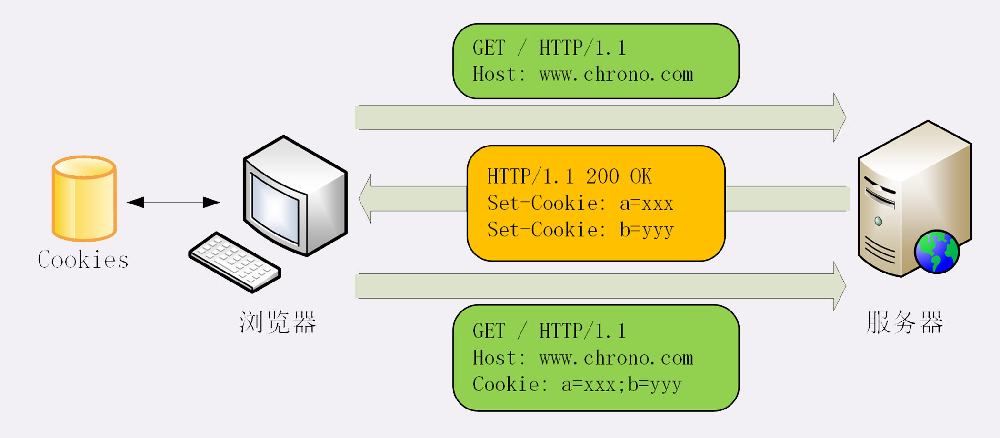

## HTTP 的 Cookie 机制
Cookie 技术，给 HTTP 增加了「记忆能力」弥补 HTTP「无状态」的特性。

本质上来讲：**Cookie 就是服务器委托浏览器存储在客户端里的一些数据**

### 工作流程：

+ 当用户通过浏览器第一次访问服务器的时候，服务器肯定是不知道他的身份的。所以，就要创建一个独特的身份标识数据，格式是 **key=value**，然后放进 Set-Cookie 字段里，随着响应报文一同发给浏览器。
+ 浏览器收到响应报文，看到里面有 Set-Cookie，知道这是服务器给的身份标识，于是就保存起来，下次再请求的时候就自动把这个值放进 Cookie 字段里发给服务器。
+ 因为第二次请求里面有了 Cookie 字段，服务器就知道这个用户不是新人，之前来过，就可以拿出 Cookie 里的值，识别出用户的身份，然后提供个性化的服务。

过程如下：

由此可以看出，Cookie 是由浏览器负责存储的，而不是操作系统。所以，它是浏览器绑定的，只能在本浏览器内生效。 
如果换个浏览器或者换台电脑，新的浏览器里没有服务器对应的 Cookie

### Cookie 的属性

先看一个例子：
`Set-Cookie: favorite=hamburger; Max-Age=10; Expires=Sat, 06-Mar-21 09:14:22 GMT; Domain=www.chrono.com; Path=/; HttpOnly; SameSite=Strict`

1. Cookie 的生命周期：
- **Expires** 俗称 **过期时间**，用的是 **绝对时间点** ，可以理解为 **截止日期**（deadline）。
- **Max-Age** 用的是相对时间，单位是秒，浏览器用收到报文的时间（date）点再加上 Max-Age，就可以得到失效的绝对时间。
+ **浏览器会优先采用 Max-Age 计算失效期**

2. Cookie 的作用域：
**设置 Cookie 的作用域** ，**让浏览器仅发送给特定的服务器和 URI** ，避免被其他网站盗用。

例如，如果设置 Domain=mozilla.org，则 Cookie 也包含在子域名中（如developer.mozilla.org）。

Domain 指定了哪些主机可以接受 Cookie。如果不指定，默认为 origin，**不包含子域名**。如果指定了Domain，则一般包含子域名。
同时指定 Path 就用一个 `/` 或者直接省略，表示域名下的任意路径都允许使用 Cookie
因此，指定 Domain 比省略它的限制要少。

3. Cookie 的安全性：
+ HttpOnly：属性 **HttpOnly** 会告诉浏览器，此 Cookie 只能通过浏览器 HTTP 协议传输，**禁止其他方式访问** ，浏览器的 JS 引擎就会禁用 `document.cookie`  等一切相关的 API，脚本攻击也就无从谈起了。
+ **SameSite**： 可以防范 **跨站请求伪造（XSRF）攻击** ：设置成
    1. `SameSite=Strict` ：可以严格限定 Cookie 不能随着跳转链接跨站发送（浏览器将只在访问相同站点时发送 cookie）
    2. `SameSite=Lax`：则略宽松一点，允许 `GET/HEAD`  等安全方法，但禁止 POST 跨站发送。
    3. `None`：不限制
+ **Secure**：
表示这个 Cookie **仅能用 HTTPS 协议加密传输** ，明文的 HTTP 协议会禁止发送。但 Cookie 本身不是加密的，浏览器里还是以明文的形式存在。

### 小结：
1. Cookie 是服务器委托浏览器存储的一些数据，让服务器有了记忆能力；
2. 响应报文使用 Set-Cookie 字段发送 key=value 形式的 Cookie 值；
3. 请求报文里用 Cookie 字段发送多个 Cookie 值；
4. 为了保护 Cookie，还要给它设置有效期、作用域等属性，常用的有 Max-Age、Expires、Domain、HttpOnly 等；
5. Cookie 最基本的用途是身份识别，实现有状态的会话事务。
