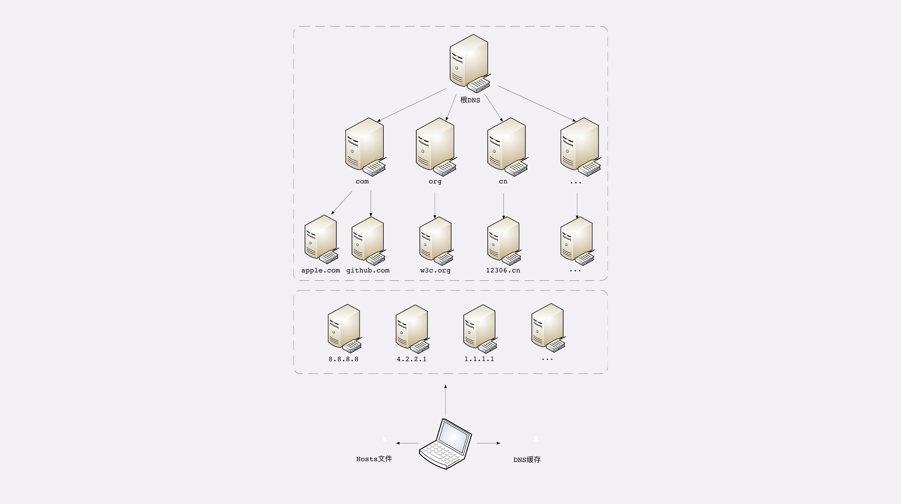

## HTTP 是什么
### 超文本传输协议:
HTTP 是一个在计算机世界里专门在两点之间传输文字、图片、音频、视频等超文本数据的约定和规范

### 详细说明：
1. HTTP 是一个用在计算机世界里的协议，它确立了一种计算机之间交流通信的规范，以及相关的各种控制和错误处理方式。
2. HTTP 专门用来在两点之间传输数据，不能用于广播、寻址或路由。
3. HTTP 传输的是文字、图片、音频、视频等超文本数据。
4. HTTP 是构建互联网的重要基础技术，它没有实体，依赖许多其他的技术来实现，但同时许多技术也都依赖于它。

### 与 HTTP 日常相关的应用

1. 互联网上绝大部分资源都使用 HTTP 协议传输；
2. 浏览器是 HTTP 协议里的请求方，即 User Agent；
3. 服务器是 HTTP 协议里的应答方，常用的有 Apache 和 Nginx；
4. CDN 位于浏览器和服务器之间，主要起到缓存加速的作用；
5. 爬虫是另一类 User Agent，是自动访问网络资源的程序。

### 与 HTTP 相关的各种协议

1. TCP/IP 是网络世界最常用的协议，HTTP 通常运行在 TCP/IP 提供的可靠传输基础上；
2. DNS 域名是 IP 地址的等价替代，需要用域名解析实现到 IP 地址的映射；
3. URI 是用来标记互联网上资源的一个名字，由 `协议名 + 主机名 + 路径` 构成，俗称 URL；
4. HTTPS 相当于 `HTTP+SSL/TLS+TCP/IP` ，为 HTTP 套了一个安全的外壳；
5. 代理是 HTTP 传输过程中的中转站，可以实现缓存加速、负载均衡等功能。

### TCP/IP 网络分层模型：
TCP/IP 协议总共有四层，就像搭积木一样，每一层需要下层的支撑，同时又支撑着上层，任何一层被抽掉都可能会导致整个协议栈坍塌。

我们来仔细地看一下这个精巧的积木架构，注意它的层次顺序是 **从下往上** 数的，所以第一层就是最下面的一层。

第一层叫 **链接层** （link layer），负责在以太网、WiFi 这样的底层网络上发送原始数据包，工作在网卡这个层次，使用 **MAC 地址来标记网络上的设备** ，所以有时候也叫 MAC 层。

第二层叫 **网际层** 或者 **网络互连层** （internet layer），IP 协议就处在这一层。因为 IP 协议定义了 **IP 地址** 的概念，所以就可以在 **链接层** 的基础上，**用 IP 地址取代 MAC 地址** ，把许许多多的局域网、广域网连接成一个虚拟的巨大网络，在这个网络里找设备时只要把 IP 地址再「翻译」成 MAC 地址就可以了。

第三层叫 **传输层**（transport layer），这个层次协议的职责是保证数据在 IP 地址标记的两点之间可靠地传输，是 TCP 协议工作的层次，另外还有它的一个小伙伴 UDP。

**TCP 是一个有状态的协议，需要先与对方建立连接然后才能发送数据** ，而且保证数据不丢失不重复。而 UDP 则比较简单，它无状态，不用事先建立连接就可以任意发送数据，但不保证数据一定会发到对方。两个协议的另一个重要区别在于数据的形式。TCP 的数据是连续的字节流，有先后顺序，而 UDP 则是分散的小数据包，是顺序发，乱序收

- MAC 层的传输单位是帧（frame）
- IP 层的传输单位是包（packet）
- TCP 层的传输单位是段（segment）
- HTTP 的传输单位则是消息或报文（message）

### DNS域名解析相关点
**域名** 本质上还是个 **名字空间系统**，使用多级域名就可以划分出不同的国家、地区、组织、公司、部门，每个域名都是独一无二的，可以作为一种身份的标识

域名必须要转换成 IP 地址：这个过程就是 **域名解析**

DNS 解析过程：
+ 浏览器缓存 -> 操作系统缓存 -> 操作系统 host 文件 -> dns 服务器
+ 而 dns 服务器查找顺序为： 根域名服务器 -> 顶级域名服务器 -> 二级域名服务器
+ eg，如果要访问 `www.apple.com` ，就要进行下面的三次查询：
    1. 访问根域名服务器，它会告诉你 `com` 顶级域名服务器的地址；
    2. 访问 `com` 顶级域名服务器，它再告诉你 `apple.com` 域名服务器的地址；
    3. 最后访问 `apple.com` 域名服务器，就得到了 `www.apple.com` 的地址。

DNS 的核心系统是一个三层的树状、分布式服务，基本对应域名的结构：

