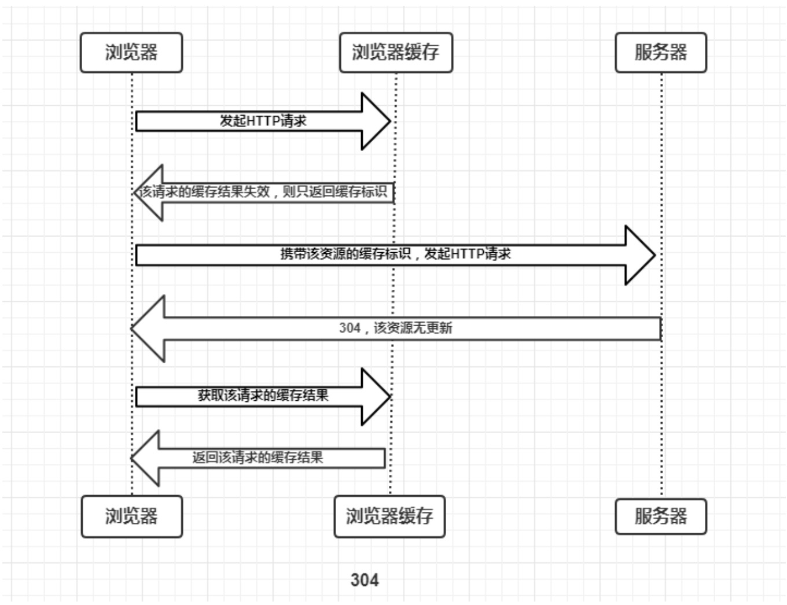
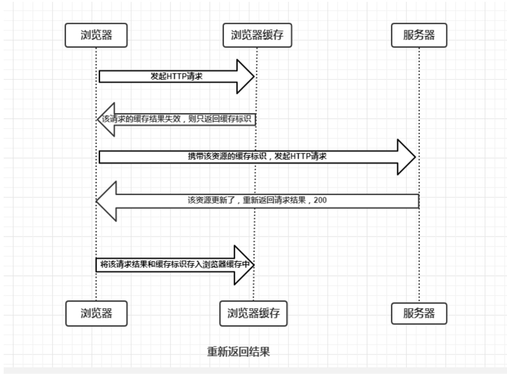
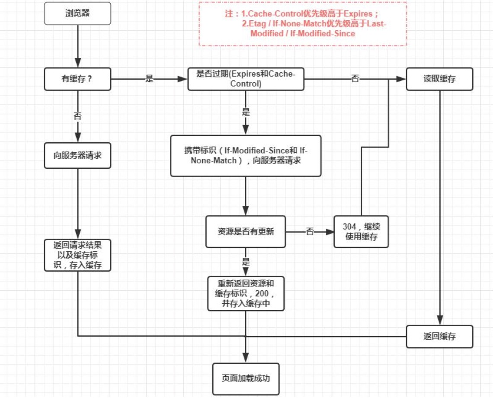

# 协商缓存
协商缓存就是强制缓存失效后，浏览器**携带缓存标识**向服务器发起请求，由服务器根据缓存标识决定是否使用缓存的过程

+ 协商缓存生效，返回304，如下：

+ 协商缓存失效，返回200和请求结果结果，如下：

## 协商缓存的标识

1. Last-Modified / If-Modified-Since （绝对时间值）
   + Last-Modified：是服务器响应请求时，返回该资源文件在服务器最后被修改的时间。
   + If-Modified-Since：则是客户端再次发起该请求时，携带上次请求返回的Last-Modified值，通过此字段值告诉服务器该资源上次请求返回的最后被修改时间。
  
服务器收到该请求，发现请求头含有If-Modified-Since字段，则会根据其值与该资源在服务器的最后被修改时间做对比。若服务器中的该资源最后修改时间大于请求头中的If-Modified-Since字段，则重新返回资源，状态码：200.否则命中协商缓存，返回304，代表资源无更新，继续使用缓存

2. Etag / If-None-Match （唯一值标识）
    + Etag是服务器响应请求时，返回当前资源文件的一个唯一标识(由服务器生成)
    + If-None-Match是客户端再次发起该请求时，携带上次请求返回的唯一标识Etag值，通过此字段值告诉服务器该资源上次请求返回的唯一标识值。

服务器收到该请求后，发现该请求头中含有If-None-Match，则会根据这个字段值与该资源在服务器的Etag值做对比：一致则返回304，代表资源无更新，继续使用缓存文件；不一致则重新返回资源文件，状态码为200，

注意： Etag / If-None-Match优先级高于Last-Modified / If-Modified-Since，同时存在则只有Etag / If-None-Match生效。

## 总结：
+ 强制缓存优先于协商缓存进行，若强制缓存(Expires和Cache-Control)生效则直接使用缓存，若不生效则进行协商缓存(Last-Modified / If-Modified-Since和Etag / If-None-Match)
+ 协商缓存由服务器决定是否使用缓存，若协商缓存失效，那么代表该请求的缓存失效，重新获取请求结果，再存入浏览器缓存中；生效则返回304，继续使用缓存。

