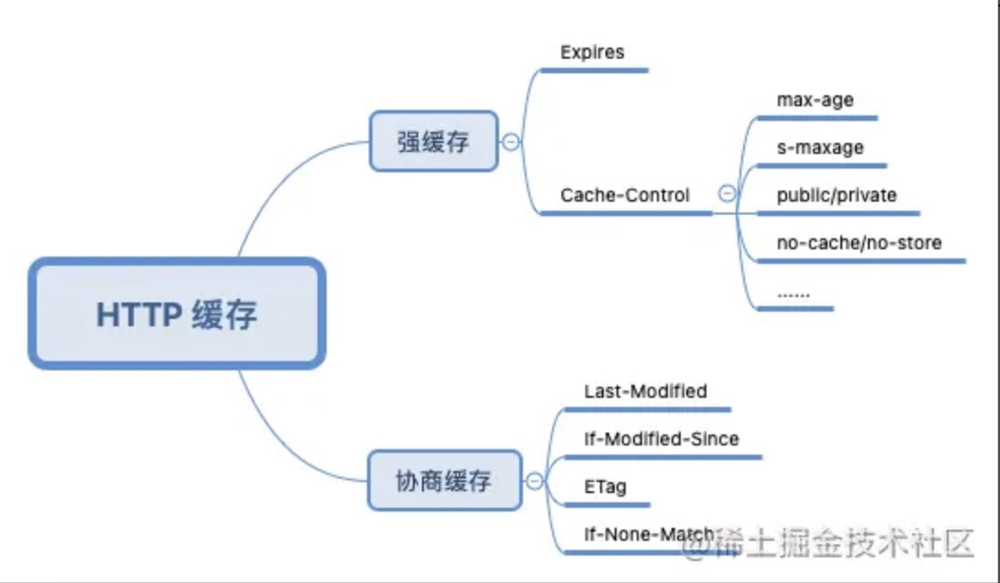
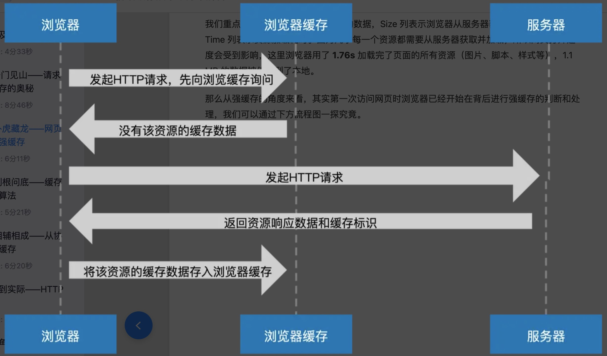

# 浏览器缓存

知识体系如下：

## 强缓存

现象：第一次访问网站打开速度会有点慢，再次访问的时候就快了很多。其背后主要还是强缓存在起作用。

+ 当浏览器发起 HTTP 请求时，会向浏览器缓存进行一次询问，若浏览器缓存没有该资源的缓存数据，那么浏览器便会向服务器发起请求。服务器接收请求后将资源返回给浏览器，浏览器会将资源的响应数据和缓存标识存储到浏览器缓存中，这便是**强缓存的生成过程**
+ 当第二次发起同样的请求时，浏览器直接去访问浏览器缓存拿到响应数据
  
## 强缓存字段
   
那些被浏览器缓存的资源的特点，**响应报头**中都包含了与强缓存有关的首部字段：Expires 或 Cache-Control。

1. max-age 与 s-maxage:
   
eg: `cache-control: max-age=2592000,s-maxage=3600`.
+ 该缓存标识表示：此资源将被浏览器缓存 2592000 秒（即 30 天），30 天之内我们再次访问，该资源都将从浏览器缓存中读取。
+ 但是需要注意图中首部值还包括了 s-maxage=3600 秒。**s-maxage 仅在代理服务器中生效，在代理服务器中 s-maxage 优先级高于 max-age，同时出现时 max-age 会被覆盖**

所以：当浏览器缓存 30 天之后重新向 CDN 服务器获取资源时，此时 CDN 缓存的资源(3600 秒)也已经过期，会触发回源机制，即向源服务器发起请求更新缓存数据。

2. expires

+ Expires 设置的缓存过期时间是一个**绝对时间**，所以会受客户端时间的影响而变得不精准.
+ 其值为服务器返回该请求结果缓存的到期时间，即再次发起该请求时，如果客户端的时间小于Expires的值时，直接使用缓存结果。

注意：在无法确定客户端的时间是否与服务端的时间同步的情况下，Cache-Control相比于expires是更好的选择，所以同时存在时，只有Cache-Control生效。