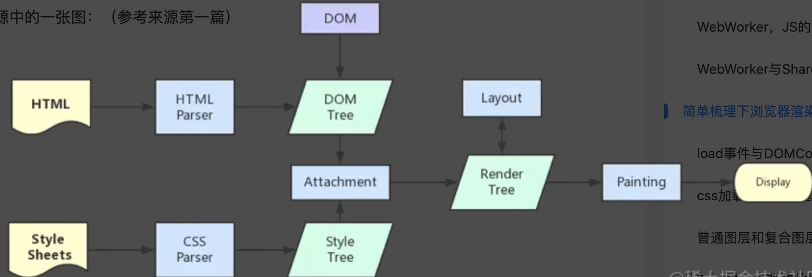

## 浏览器的主要组成部分

1. 用户界面：包括地址栏、前进/后退按钮、书签菜单等。（除了浏览器主窗口显示的您请求的页面外，其他显示的各个部分都属于用户界面）
2. 浏览器引擎：在用户界面和渲染引擎之间传送指令。
3. 渲染引擎：负责显示请求的内容。如果请求的内容是 HTML，它就负责解析 HTML 和 CSS 内容，并将解析后的内容显示在屏幕上。
4. 网络：用于网络调用，比如 HTTP 请求。
5. UI后端：用于绘制基本的窗口小部件，比如组合框和窗口。
6. JS引擎：用于解析和执行 JavaScript 代码。
7. 数据存储：这是持久层。浏览器需要在硬盘上保存各种数据，例如 Cookie。


## 渲染过程（重点）多线程

如下图：




过程：
1. HTML解析创建DOM树
  + 转码: 浏览器将接收到的二进制数据按照指定编码格式转化为HTML字符串
  + 生成Tokens: 开始parser，浏览器会将HTML字符串解析成Tokens。
  + 构建Nodes: 对Node添加特定的属性，通过指针确定 Node 的父、子、兄弟关系和所属treeScope
  + 生成DOM Tree: 通过node包含的指针确定的关系构建出DOM Tree
  
2. 解析 CSS（包括外部 CSS 文件和样式元素）创建的是 CSSOM 树。
3. （CSSOM 的解析过程与 DOM 的解析过程是并行的）
4. 渲染树 Render tree ：CSSOM 与 DOM 结合，得到的就是渲染树.
5. 布局渲染书：从渲染树的根结点开始递归，计算每一个元素的大小、位置等，给出每个节点所应该出现在屏幕上的精确坐标。从而得到**布局渲染树**
6. 绘制渲染树：遍历渲染树，每个节点将使用 UI 后端层来绘制
7. 浏览器会将各图层的信息发送给GPU，GPU会将各层合成（composite），显示在屏幕上。

之后，每当一个新元素加入到这个 DOM 树当中，浏览器便会通过 CSS 引擎查遍 CSS 样式表，找到符合该元素的样式规则应用到这个元素上，然后再重新去绘制它。

### load事件与DOMContentLoaded事件的先后：
+ 当 DOMContentLoaded 事件触发时，仅当DOM加载完成。（不包括样式表，图片。如果有async加载的脚本，DOM加载就不一定完成）
+ 当 onload 事件触发时，页面上所有的DOM，样式表，脚本，图片都已经加载完成了。（即渲染完毕时，触发）
  

## CSS的匹配与阻塞

CSS 引擎查找样式表对每条规则都按从右往左的顺序去匹配。

eg1:
```
#myList  li {}
```

+ 平时习惯了从左到右阅读的文字阅读方式，会本能地以为浏览器也是从左到右匹配 CSS 选择器的
+ #myList 是一个 id 选择器，它对应的元素只有一个，查找起来应该很快。定位到了 myList 元素，等于是缩小了范围后再去查找它后代中的 li 元素，没毛病。
+ 事实上，CSS 选择符是从右到左进行匹配的。我们这个看似“没毛病”的选择器，实际开销相当高：浏览器要遍历每个 li 元素，每次都要判断li元素的父元素id是不是#myList。

eg2:
```
* {}
```
这个家伙很恐怖，它会匹配所有元素，所以浏览器必须去遍历每一个元素！

根据上面的分析，我们至少可以总结出如下性能提升的方案：

+ 避免使用通配符，只对需要用到的元素进行选择。
+ 关注可以通过继承实现的属性，避免重复匹配重复定义。
+ 避免使用标签选择器，如果可以，用类选择器替代：
+ `#myList li{}`  =》 `.myList_li {}`
+ 减少嵌套


说完了过程，我们来说一说阻塞渲染的特性。

### CSS 的阻塞
+ 在刚刚的过程中，我们提到 DOM 和 CSSOM 合力才能构建渲染树。这一点会给性能造成严重影响：默认情况下，CSS 是阻塞的资源。
+ 浏览器在构建 CSSOM 的过程中，不会渲染任何已处理的内容。即便 DOM 已经解析完毕了，只要 CSSOM 不 OK，那么渲染这个事情就不 OK (这主要是为了避免没有 CSS 的 HTML 页面丑陋地“裸奔”在用户眼前)
+ 但浏览器在构建 CSSOM 的过程中，不会影响html的解析，构建DOM树。CSSOM树的创建和DOM树的创建是两个并行的过程
+ 我们开始解析 HTML 后、解析到 link 标签或者 style 标签时，CSS 才登场，CSSOM 的构建才开始。很多时候，DOM 不得不等待 CSSOM。因此我们可以这样总结：**CSS 是阻塞渲染的资源。需要将它尽早、尽快地下载到客户端，以便缩短首次渲染的时间。**
+ 尽早（将 CSS 放在 head 标签里）和尽快（启用 CDN 实现静态资源加载速度的优化）


## JS 的阻塞
JS 的作用在于修改，它帮助我们修改网页的方方面面：内容、样式以及它如何响应用户交互。这“方方面面”的修改，本质上都是对 DOM 和 CSSDOM 进行修改。
因此 JS 的执行会阻止 CSSOM，在我们不作显式声明的情况下，它也会阻塞 DOM。

+ JS 引擎是独立于渲染引擎存在的。我们的 JS 代码在文档的何处插入，就在何处执行。
+ 当 HTML 解析器遇到一个 script 标签时，它会暂停渲染过程，将控制权交给 JS 引擎。JS 引擎对内联的 JS 代码会直接执行，对外部 JS 文件还要先获取到脚本、再进行执行。
+ 等 JS 引擎运行完毕，浏览器又会把控制权还给渲染引擎，继续 CSSOM 和 DOM 的构建。 
+ 因此与其说是 JS 把 CSS 和 HTML 阻塞了，不如说是 JS 引擎抢走了渲染引擎的控制权。

假如我们可以确认一个 JS 文件的执行时机并不一定非要是此时此刻，我们就可以通过对它使用 defer 和 async 来避免不必要的阻塞，这里我们就引出了外部 JS 的三种加载方式：

图示：


+ 正常模式： `<script src="index.js"></script>` 这种情况下 JS 会阻塞浏览器，浏览器的渲染必须等待 index.js 加载和执行完毕才能去做其它事情。
+ async 模式：`<script async src="index.js"></script>` 它的加载是异步的，当它加载结束（网络请求），JS 脚本会立即执行。通过异步的方式使得该 Script 的网络请求优先级降低，延长响应时间。
+ defer 模式：`<script defer src="index.js"></script>` 此时JS 的加载是异步的，执行是被推迟的。（等整个文档解析完成、DOMContentLoaded 事件即将被触发时，被标记了 defer 的 JS 文件才会开始依次执行）


注意：
+ 异步脚本是网络请求期间不阻塞 DOM，拿到脚本之后马上执行，执行时还是会阻塞 DOM。但是由于响应时间被延长，此时往往 DOM 已经构建完毕，异步脚本的执行发生在第一次渲染之后。
+ 只有外部脚本可以使用async关键字变成异步，而且注意其与延迟脚本defer的区别：
  1. 后者是在 Document 被解析完毕而 DOMContentLoaded 事件触发之前执行。
  2. 前者则是在下载完毕后执行。

阻塞问题具体查看[文档一](https://juejin.cn/post/6973949865130885157)以及[文档二](https://github.com/Advanced-Frontend/Daily-Interview-Question/issues/510)